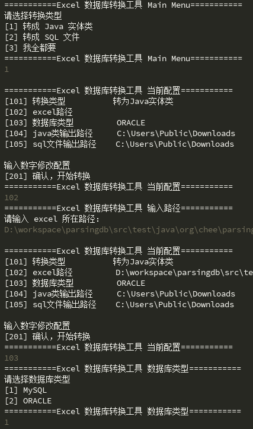
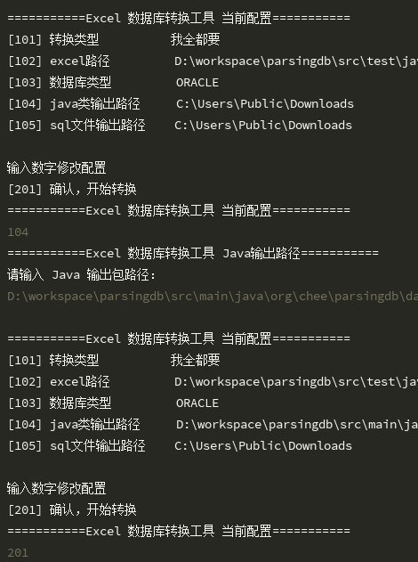

# parsing db

这是一个将 excel 的数据库设计转为 SQL 语句建表文件及 Java 实体类的工具。  

虽然 idea 中有类似的转换功能，但转换格式不近如人意，故开发此工具。  

目前仅支持 MySQL 和 Oracle。

## 运行方式

下载 Release 中的 Jar 包后使用`java -jar parsingdb.jar`命令运行 Jar 包，或下载原码后，运行 Main 类中的 main 方法。

## 转换操作

根据提示修改转换设置

注意问题：

1. Java 类的输出路径需包含`src/main/java`，因为需要根据这个生成 package 信息；
2. 生成的实体类默认使用 lombok 插件，因此未生成 getter setter 和 toString 方法。

如果需要转换多个 excel，可无需关闭程序，修改路径后再次转换即可。